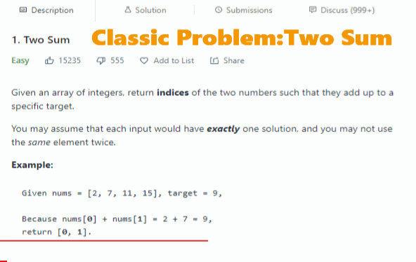
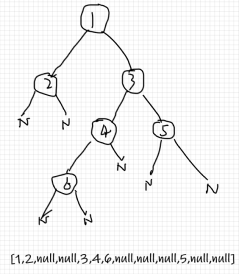

# leetcode-testcase-helper

[中文README](./README_CHN.md)

help you input(in leetcode's format)and manage testcases handily when you doing leetcode's problem in local IDE.

本地IDE做leetcode题时,帮助你将leetcode格式的多个测试用例输入并使用。




### feature

- write multiple testcases in a text file

- generate variables in cpp code from the text file

- support  usual data type in leetcode's problem

  

### File

- case.cpp       generate testcase variables from text file

- printer.cpp    print usual data type in leetcode's problem conveniently

>case.py  python3 version


### Data Type

- int,  char, bool,  string  (exclude float, double):  one element a line,for string, `"elem"` or `elem` are both ok

- vector<>:    `e1,e2,e3,e4,e5` or `[e1,e2,e3,e4,e5]`, **must be in one line**, space in anywhere will not bother(exclude string)

- vector<vector<>>: `[[e1,e2,e3],[e4,e5,e6]]`, **must be in one line**, pace in anywhere will not bother(exclude string)

- ListNode*  : same as vector<>

- TreeNode*  : 

  

  same with leetcode

### Example
project directory

———dir/

—————case.cpp

—————printer.cpp

———data/

—————a_problem.txt

———a_problem.cpp

   

```cpp
//a_problem.cpp
#include"dir/case.cpp"
#include"dir/printer.cpp"
//other include file
class Solution{
    public:
    //same with the template of leetcode problems
    ListNode* func(int p1,vector<string> p2,vector<vector<int>>p3){
      //...  
    };
}

int main(){
    Case c = Case("","data/a_problem.txt");//a_problem:your testcase file name
    
    int e1;//fisrt parameter's type :int
    vector<string> e2;//second parameter's type
    vector<vector<int>> e3;    //2-d array
    ListNode*  _answer;//return type
    
    vector<decltype(e1)> p1; vector<decltype(e2)> p2;  vector<decltype(e3)> p3;  			vector<decltype(_answer)> answers;
    	
    c.data(p1, p2, p3,answers);   
    size_t L = 0, R = p1.size();

    Printer pr;
    for (size_t i = L; i != R;i++){
        Solution s;
        auto rs =s.func(p1[i],p2[i],p3[i]);
        if(rs==answers[i]){     
            cout << "PASS" << endl;
        }else{       
            cout << "NOT PASS" << endl;
            pr.print(answers[i]);//print vector<TreeNode*>
            pr.print(rs);//print vector<TreeNode*>
            cout<<endl;
        }
    }
    return 0;
}


```


//file: a_problem   **warning: not support annotation in this file , ensure no new line at the tail**

```
1   
["somestr","somestr2","somestr3"]
[[1,2,3],[4,5,6],[7,8,9]]

5252
["somestr4","somestr20","somestr53"]
[[11,32,3,55],[4,5,6],[7,8,9]]

4141
["somestr4","somestr20","somestr53"]
[[11,32,3,55],[4,5,6],[7,8,9]]

...
```

