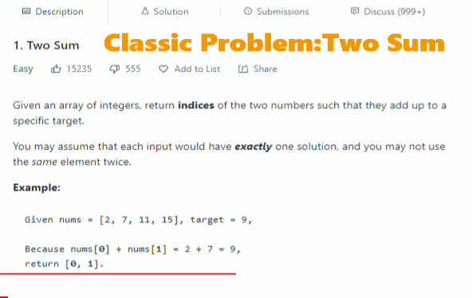
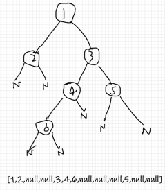

# leetcode-testcase-helper


本地IDE做leetcode题时,帮助你将leetcode格式的多个测试用例输入并使用。



### feature

- 把多个测试用例写在一个文本文件里

- 从文本文件里生成代码里函数方法需要的参数变量

- 支持了leetcode problem中常见数据类型

  

### File

- case.cpp       生成测试用例的文件
- printer.cpp    方便打印leetcode problem中常见数据类型

> case.py  python3版本，和cpp版本略有不同

### Data Type

- int, char, bool, string (不支持浮点类型)： 每行一个元素，对于string，加不加双引号""都可以

- vector<>:  `e1,e2,e3,e4,e5` or `[e1,e2,e3,e4,e5]`, **必须在一行内**, 行前、行后、元素前后有空格不影响

- vector<vector<>>: `[[e1,e2,e3],[e4,e5,e6]]`, **必须在一行内**, 行前、行后、元素前后有空格不影响

- ListNode*： 同vector<>

- TreeNode*:

  

格式和leetcode中的TreeNode testcase一样

### Example

目录结构 project directory

--- dir/
   -- case.cpp
   -- printer.cpp

--- data/

 	-- a_problem.txt

--- a_problem.cpp

```cpp
//a_problem.cpp
#include"dir/case.cpp"
#include"dir/printer.cpp"
//other include file
class Solution{
    public:
    //same with the template of leetcode problems
    ListNode* func(int p1,vector<string> p2,vector<vector<int>>p3){
      //...  
    };
}

int main(){
    Case c = Case("","data/a_problem.txt");//a_problem:your testcase file name
    
    int e1;//fisrt parameter's type :int
    vector<string> e2;//second parameter's type
    vector<vector<int>> e3;    //2-d array
    ListNode*  _answer;//return type
    
    vector<decltype(e1)> p1; vector<decltype(e2)> p2;  vector<decltype(e3)> p3;  			vector<decltype(_answer)> answers;
    	
    c.data(p1, p2, p3,answers);   
    size_t L = 0, R = p1.size();

    Printer pr;
    for (size_t i = L; i != R;i++){
        Solution s;
        auto rs =s.func(p1[i],p2[i],p3[i]);
        if(rs==answers[i]){     
            cout << "PASS" << endl;
        }else{       
            cout << "NOT PASS" << endl;
            pr.print(answers[i]);//print vector<TreeNode*>
            pr.print(rs);//print vector<TreeNode*>
            cout<<endl;
        }
    }
    return 0;
}


```


//file: a_problem   warning: not support annotation

```
1   
["somestr","somestr2","somestr3"]
[[1,2,3],[4,5,6],[7,8,9]]

5252
["somestr4","somestr20","somestr53"]
[[11,32,3,55],[4,5,6],[7,8,9]]

4141
["somestr4","somestr20","somestr53"]
[[11,32,3,55],[4,5,6],[7,8,9]]
//...


```

